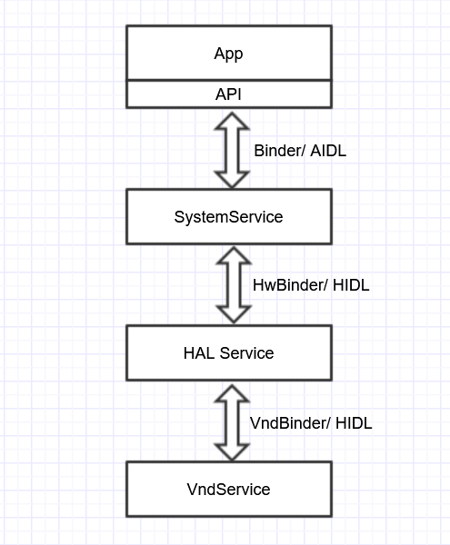

# Binder Communication Architecture
IPC communication Architecture of Android

### The diagram is to show the IPC communication Architecture of Android and their allocation to the different domains

* Binder
  > All AIDL based communication between SystemServices and SystemService↔Apps.
* HwBinder
  > All HIDL based communication between HALs and HAL↔SystemServices.
* VndBinder
  > All AIDL based communication between HALs and HAL↔VndServices. VndServices suite as common Services for HAL implementation.
